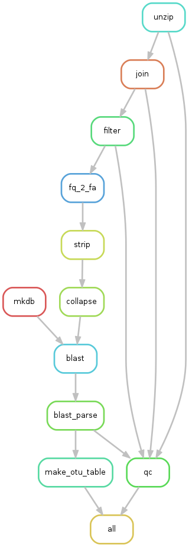

# Snakemake Microbiome Pipeline

## Download pipeline
```bash
git clone https://github.com/liluacrobat/SnaMPv2_HOMD.git
```

## Create environment

```bash
module load python/anaconda2-4.2.0
conda create -c bioconda -m -p pyenvs/py35-snakemake python=3.5 pandas snakemake
```

## Load environment

```bash
module load python/anaconda2-4.2.0
source activate pyenvs/py35-snakemake
```

## Remove environment

```
source deactivate
```

## Workflow

  * Closed reference OTU picking
  * BLAST agaist HOMD database



### Usage

1. Prepare sequencing data

  Repalce the `$SOURCE_FILES` with the __zipped__ sequencing result, e.g. `WHI_Repo/RT530_Batch2/*.gz`

  ```bash
  cd input
  ln -s $SOURCE_FILES .
  cd ..
  ```

2. Launch jobs

  The pipeline will utilize CCR resource to parallel execution.
  OTU table and statisics about merge rate, filter rate, hit rate wiil be placed under _table_

  ```bash
  snakemake -p -j 100 --cluster-config cluster.json --cluster "sbatch --partition {cluster.partition} --time {cluster.time} --nodes {cluster.nodes} --ntasks-per-node {cluster.ntasks-per-node}"
  ```

3. Results

 Three result files are placed under `table` directory.
 
 * QC_table.txt  
 * raw_OTU_table_collapsed.txt  
 * raw_OTU_table_uncollapsed.txt
 

## Misc

  To remove generated files:
  ```
  snakemake clean
  ```

  Check snakemake version:
  ```
  snakemake -v
  # 3.13.3
  ```

## Known Issues

* cluster time limit: if any of the jobs run of the time limit, it will be silently killed by CCR and the pipeline will keep waiting. To solve this, you need to terminate `Snakemake`, increase time limit specified in `cluster.json` accordingly and rerun the pipeline with extra option `--rerun-incomplete`.
